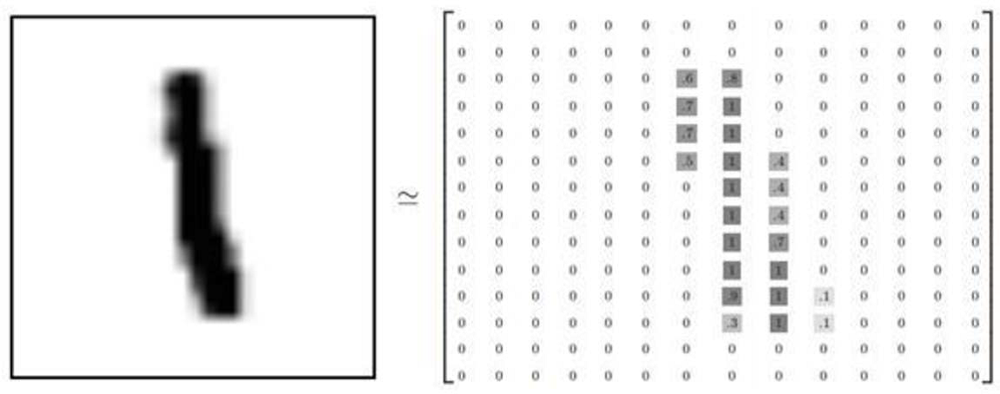
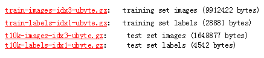
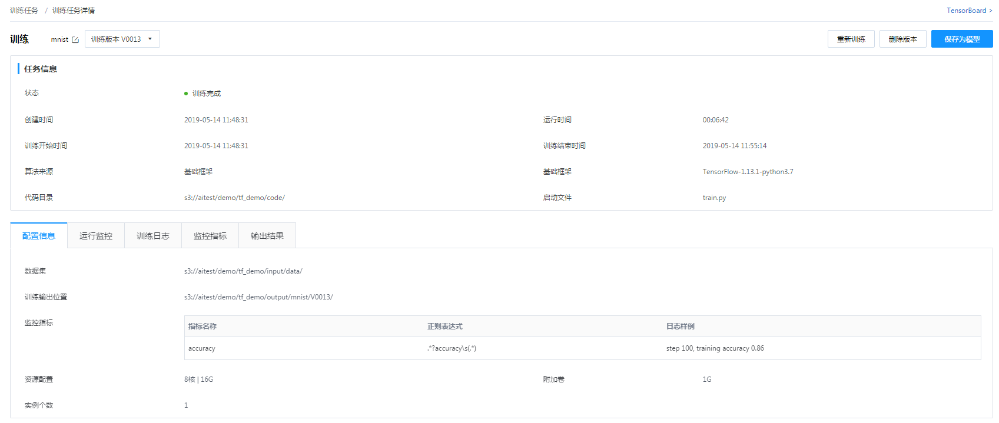
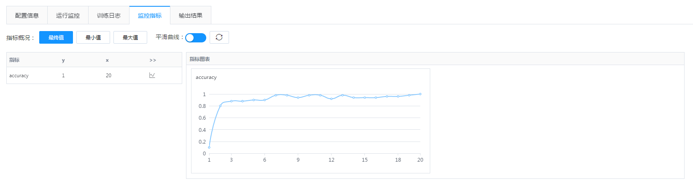
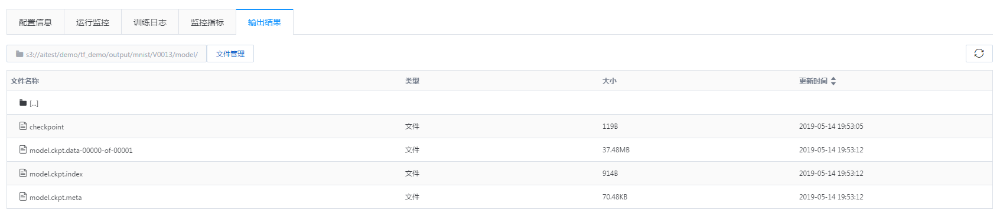

# MNIST手写数字识别Demo(基于tensorflow基础框架)
## 1.数据集介绍  
　　本例采用MNIST手写数据集，MNIST是深度学习的经典入门demo，他是由6万张训练图片和1万张测试图片构成的，这些图片是采集的不同的人手写从0到9的数字，每张图片都是28*28大小。这些图片并不是传统意义上的png或jepg格式的图片，因为png或jpg的图片格式，会带有很多干扰信息(如:数据块，图片头，图片尾，长度等等)，这些图片会被处理成很简易的二维数组，如图:
  
## 2.数据集准备
　　MNIST数据集的下载地址： http://yann.lecun.com/exdb/mnist/  
　　需要下载以下数据集：  
　　  
　　需要下载MNIST数据集，并上传到s3对象存储空间，训练时需要将s3信息告知ModelMaker，ModelMaker会将数据集下载到容器的/opt/ai/input/data/目录，供训练代码读取和使用。  
## 3.代码及依赖环境准备
### 3.1代码
　　基于tensorflow基础框架，需要自己编写训练及推理代码，并上传代码到s3或者github，并将训练及推理阶段将代码下载信息告知ModelMaker，ModelMaker会将代码下载到/opt/ai/src/目录下。（可以从code目录获取本例代码）  
　　训练代码需要关注以下路径信息：  
　　　　数据集目录： /opt/ai/input/data/  
　　　　其他输入文件目录：/opt/ai/input/名称/  
　　　　训练输出目录(用于存储模型、日志等需要持久化的数据)：/opt/ai/output/  
　　　　分布式训练时实例信息：/opt/ai/config/resource.json  
　　推理代码需要关注以下路径信息：  
　　　　模型文件目录：/opt/ai/model/  
### 3.2依赖库（可选）
　　基础镜像中有预装了部分python库，如果还需要其它python库，可以在代码目录下的 requirements.txt 文件中描述代码所依赖的库文件列表，ModelMaker平台会帮忙安装此部分库文件。  
　　requirements.txt文件可以使用pip freeze > requirements.txt命令生成，文件格式如下：  

        numpy==1.16.2
        requests==2.21.0
## 4.创建训练任务
在AI平台点击 训练任务 -> 创建训练任务，进行训练任务的创建。创建训练任务时，需要关注以下信息：  
_ _ _
任务信息：  
　　　　名称：　填写此次训练的名称，如手写数字识别  
　　　　算法来源选择： 基础框架  
　　　　基础框架选择： tensorflow  
　　　　代码目录：选择对象存储(s3)或者三方Git，填入代码的存储路径即可  
　　　　启动文件：代码的入口文件名称，本例为 train.py  
_ _ _
运行设置：  
　　　　运行参数：填写运行时参数，执行启动文件时，传入的参数，可用于设置超参数等，本例不需要填写  
_ _ _
输入：  
　　　　数据集： 选择步骤2数据集准备中上传的s3路径（也可直接选择公共数据集中的MNIST数据集）  
　　　　输入文件： 可用于传入初始模型、配置等，本例不需要填写  
_ _ _
输出：  
　　　　训练输出位置： 选择模型、日志文件保存的s3位置，系统会将/opt/ai/output下的所有内容（如log、模型等）输出至该目录  
　　　　监控指标（可选）：系统将标准输出中满足正则的日志，提取为监控指标并绘制图表。正则表达式最多可提取两个值，默认第一个值为y，第二个值为x（x可无）  
　　　　　　指标名称：本例中填写 accuracy  
　　　　　　正则表达式：本例中填写 .*?accuracy\s(.*)  
　　　　　　日志样例：本例中填写 step 100, training accuracy 0.86  
_ _ _
运行配置：  
　　　　资源配置： 选择训练所使用的硬件资源 本例中使用最小配置 4核8G即可  
　　　　实例个数： 如果算法支持分布式训练，可以选择多个实例，可以读取/opt/ai/config/resource.json配置获取各个实例的IP和端口信息，本例放空
　　　　附加卷： 选择5G  
　　　　最长训练时间： 放空即可  
_ _ _
配置完成后，点击开始训练，即可开始训练。训练过程中可通过运行监控及训练日志，查看训练情况，训练完成后，任务状态会更新为训练完成。  
## 5.训练过程
可以在训练任务详情页中查看训练过程，主要有以下几部分信息可以查看：  

　　任务信息：  
　　　　包含训练过程的基础信息，如任务状态，运行时长等  
　　配置信息：  
　　　　训练过程中数据集、输出位置、资源配置等配置信息  
　　运行监控：  
　　　　训练过程中CPU、内存等资源使用信息  
　　训练日志：  
　　　　训练日志训练过程中输出到标准输出的日志信息，如训练过程中的 training accuracy 变化等  
　　监控指标：  
　　　　监控指标，创建训练任务时，配置的监控指标采集到的数据  

　　输出结果：  
　　　　训练输出位置的文件内容，如下图，可以看到模型文件已生成  



## 6.推理部署
训练完成后，可以在推理部署页面进行已训练模型的发布。  
_ _ _
模型管理->添加模型：  
　　　　名称： 填写此模型名称，如手写数字识别模型  
　　　　模型版本： 填写此模型的版本，如1.0  
　　　　模型类型： 选择基础框架  
　　　　基础框架： tensorflow  
　　　　模型组件路径： 填写第3步创建训练任务时，填写的 训练输出位置中模型文件所在目录  
　　　　推理代码目录：选择对象存储(s3)或者三方Git，填入代码的存储路径即可  
　　　　启动文件：代码的入口文件名称，本例为 predict.py  
_ _ _
在线部署->创建服务：  
　　　　服务名称：　填写此推理服务的名称，如手写数字识别服务  
　　　　模型及配置：  
　　　　　　模型：选择上面添加的模型，如手写数字识别模型  
　　　　　　版本：选择模型版本，如1.0  
　　　　　　权重： 当前只有一个模型，请求均由此模型服务，权重选择 100%  
　　　　　　资源配置： 推理服务的资源配置，本例中使用最小配置 4核8G即可  
　　　　　　实例个数： 创建多少个实例进行推理服务，本例中选择 1即可  
_ _ _
部署完成后，可以在服务的详细页中的调用说明，查看 API调用接口信息，后续模拟推理时，需要依赖这些信息。  
## 7.模拟推理
推理服务部署完成后，即可通过API调用模拟推理请求。模拟代码如下：  
```
from __future__ import print_function
import numpy as np
import base64
import requests
import json
import tensorflow as tf

import datetime
import base64
import hmac
import hashlib

def get_current_date():
    date = datetime.datetime.strftime(datetime.datetime.utcnow(), "%a, %d %b %Y %H:%M:%S GMT")
    return date

def to_sha1_base64(signingStr, secret):
    #print(signingStr)
    hmacsha1 = hmac.new(secret.encode(), signingStr.encode(), hashlib.sha1)
    return base64.b64encode(hmacsha1.digest()).decode()

def build_request_head():
    #用户的AK
    ak = 'MIl3JP6JBejL8wTALJFHnSBgkXwEpv5O1ZCR'
    #用户的SK
    sk = 'xVcz6SouAbPtHn7VHOc1HyCAsJZy61d6L4YMzWVCbQzq2qTSFrMmwxpBqeWcIDwI'

    #标识需要对哪些字段进行加密
    SignedHeaders = 'host;content-type;date'

    # 请求头字段说明 
    #  Host: 推理服务域名
    #  Content-Type: 请求内容类型 
    #  Date: 日期
    #  Authorization: 调用说明中的AK值
    headers = {
        
                'Host': '501750.wangsu.service.com:10000',
                'Content-Type': 'application/json',
                'Date': get_current_date(),
                'Authorization': '调用说明中的AK值'
             }
    
    #signingStr= host + \n + content-type + \n + date
    signingStr = headers['Host'] + '\n' + headers['Content-Type'] + '\n' + headers['Date']
    
    signature = to_sha1_base64(signingStr, sk)
    #Authorization = WS-HMAC-SHA1,
    #                AK=Zcg0eDmsZYK0cwmP1skyUmn9kwsmQM0HUU5, 
    #                SignedHeaders=host;content-type;date, 
    #                Signature=signature
    headers['Authorization'] = 'WS-HMAC-SHA1 '+ 'AK='+ ak +  ',SignedHeaders=' + SignedHeaders + ',Signature=' + signature
    print( headers['Authorization'])
    return headers

def prepare_data(n):
    """prepare data for inference"""
    mnist = tf.keras.datasets.mnist
    (x_train, y_train), (x_test, y_test) = mnist.load_data()
    x_test = x_test / 255.0
    x_test = x_test.astype(np.float32)
    data = np.reshape(x_test[n], (1,784))
    return data, y_test[n]


def main():
    data, label = prepare_data(0)
    payload =  {"image": data.tolist()[0]}

    response = requests.post('http://501750.wangsu.service.com:10000/ModelMaker/predict',data=json.dumps(payload), headers=build_request_head())
    response.raise_for_status()
    
    print('\nGround Truth class is:', label)   
    print('\nThe complete response:\n\n', response.json(), '\n')


if __name__ == '__main__':
  main()
```
jupyter上运行效果如下：

